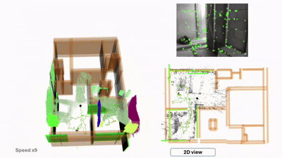
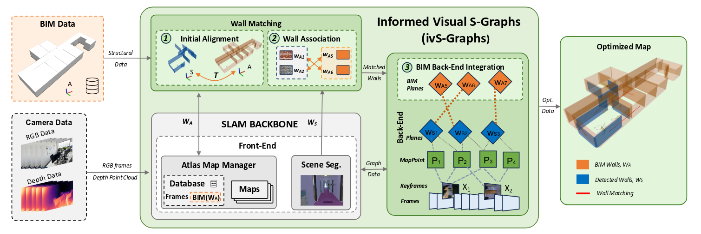

# Informed visual S-Graphs (ivS-Graphs)



<!-- Badges -->

<!-- [](https://arxiv.org/abs/2509.13972)-->

**ivS-Graphs** is inspired by [LiDAR iS-Graphs](https://www.arxiv.org/abs/2408.01737)  and extends [vS-graphs](https://github.com/snt-arg/visual_sgraphs) by integrating architecural Building Information Modelling (**BIM**) with an **optimizable 3D scene graphs**, enhancing mapping and localization accuracy through scene understanding which enables construction monitoring. 

## 🧠 ivS-Graphs Architecture

Below diagram shows the detailed architecture of the **ivS-Graphs** framework, The pipeline takes BIM and RGB-D camera data as inputs. The SLAM backbone front-end processes visual data into keyframes, map points, and wall segments. Our contributions are highlighted in green:(1) initial alignment followed by a (2) continuous wall association and (3) the integration of BIM in the back-end of the system. These establish BIM-to-SLAM correspondences (WA ↔ WS ) that are introduced as constraints into the back-end graph. The resulting optimized map (right) aligns the evolving as-built structure with the as-planned BIM



## ⚙️ Prerequisites and Installation

For system requirements, dependencies, and setup instructions, refer to the [Installation Guide](/doc/INSTALLATION.md).

## 🔨 Configurations

You can read about the SLAM-related configuration parameters (independent of the `ROS2` wrapper) in [the config folder](/config/README.md). These configurations can be modified in the [system_params.yaml](/config/system_params.yaml) file. For more information on ROS-related configurations and usage, see the [ROS parameter documentation](/doc/ROS.md) page.


<!-- 
## 🚀 Getting Started

Once you have installed the required dependencies and configured the parameters, you are ready to run **ivS-Graphs**! Follow the steps below to get started:

1. Source ivS-Graphs and run it by `ros2 launch vs_graphs vsgraphs_rgbd.launch.py`. It will automatically run the ivS-Graphs core and the semantic segmentation module for **building component** (walls and ground surfaces) recognition.
2. (Optional) If you intend to detect **structural elements** (rooms and corridors) too, run the cluster-based solution using `ros2 launch voxblox_skeleton skeletonize_map_vsgraphs.launch 2>/dev/null`.

   - In this case, you need to source `voxblox` with a `--extend` command, and then launch the framework:

   ```bash
   source /opt/ros/jazzy/setup.bash &&
   source ~/[VSGRAPHS_PATH]/install/setup.bash &&
   source ~/[VOXBLOX_PATH]/install/setup.bash --extend &&
   ros2 launch vs_graphs vsgraphs_rgbd.launch.py
   ```

3. (Optional) If you have a database of ArUco markers representing room/corridor labels, do not forget to run `aruco_ros` using `ros2 launch aruco_ros marker_publisher.launch`.
4. Now, play a recorded `bag` file by running `ros2 bag play [sample].bag --clock`.

✨ For a complete list of configurable launch arguments, check the [Launch Parameters](/launch/README.md).

✨ For detailed description on how to use a RealSense D400 series camera for live feed and data collection, check [this page](/doc/RealSense/README.md).

> 🛎️ Note: The current version of ivS-Graphs supports **ROS2 Jazzy** and is primarily tested on Ubuntu 24.04.2 LTS.

-->

## 🐋 Docker

For a fully reproducible and environment-independent setup, check the [Docker](/docker) section.

## 📏 Benchmarking

To evaluate ivS-Graphs against other visual SLAM frameworks, read the [evaluation and benchmarking documentation](/evaluation/README.md).

<!-- ## 📚 Citation

```bibtex
@misc{bikandinoya2025biminformedvisualslam,
      title={BIM Informed Visual SLAM for Construction Monitoring}, 
      author={Asier Bikandi-Noya and Miguel Fernandez-Cortizas and Muhammad Shaheer and Ali Tourani and Holger Voos and Jose Luis Sanchez-Lopez},
      year={2025},
      eprint={2509.13972},
      archivePrefix={arXiv},
      primaryClass={cs.RO},
      url={https://arxiv.org/abs/2509.13972}, 
}
```
-->
## 📎 Related Repositories

- 🔧 [Visual S-Graphs](https://github.com/snt-arg/visual_sgraphs)
- 🎞️ Scene Segmentor ([ROS2 Jazzy](https://github.com/snt-arg/scene_segment_ros))


## 🔑 License

This project is licensed under the GPL-3.0 license - see the [LICENSE](/LICENSE) for more details.

